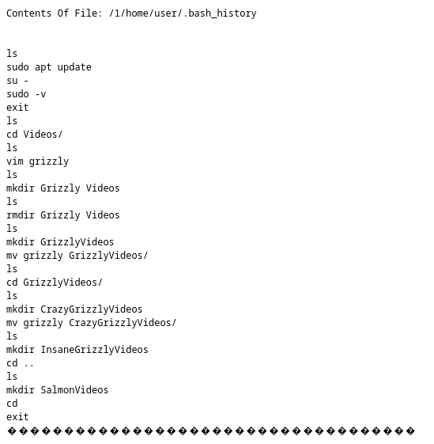
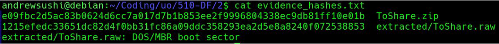
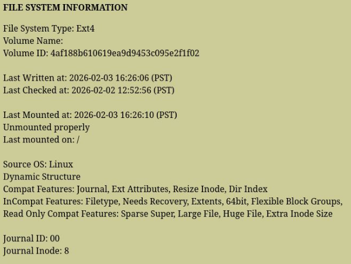
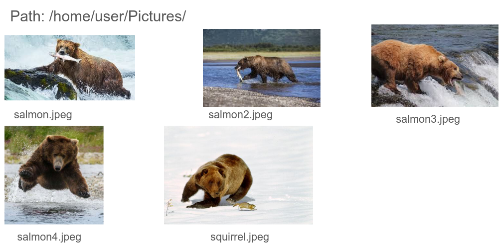
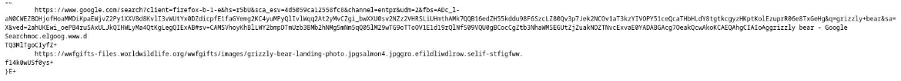
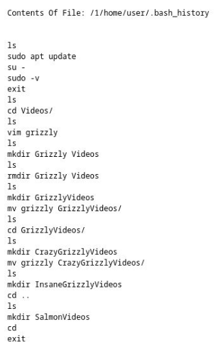
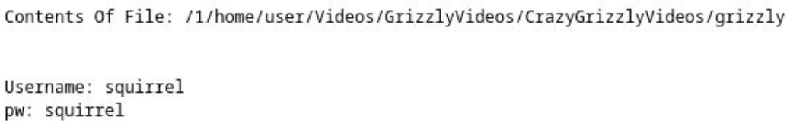
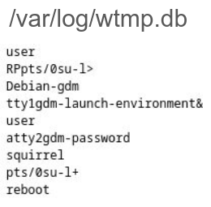
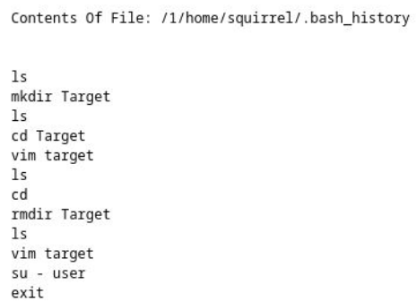

# Project 2: Hypervisor Disk Image Examination Report
## Examination of Group 5 Disk Image - Andrew Chan

## 1. Case Overview
Our team (Team 7) received a compressed archive (`ToShare.zip`) containing a Linux virtual disk image (`ToShare.raw`) for forensic examination. The objective was to reconstruct user activity, identify structured artifacts, and evaluate potential cross-account behavior within the system. The image was analyzed using Autopsy, focusing on filesystem artifacts, user activity reconstruction, credential exposure, and session transitions between accounts.

## 2. Evidence Handling & Integrity Preservation
Before we began the analysis, we extracted ToShare.raw from the provided archive and generated SHA-256 hashes for both the .zip file and the extracted .raw image. These hashes were recorded before any forensic examination began to preserve evidentiary integrity and maintain reproducibility. The raw disk image was ingested into Autopsy in a read-only forensic workflow. No modifications were made to the source image during analysis.

This process aligns with forensic best practices for:
- Integrity validation
- Chain-of-custody preservation
- Reproducibility of results


## 3. System Identification
Analysis of /etc/debian_version and filesystem metadata confirmed:
- Operating System: Debian Linux
- Filesystem: EXT4 
The EXT4 journaled filesystem is relevant because it preserves metadata timestamps (MAC times), which were used in timeline reconstruction.



## 4. User Accounts & System Structure
Inspection of /etc/passwd revealed two interactive user accounts 
- user (UID 1000)
- squirrel (UID 1001)
Both accounts were configured with /bin/bash, confirming interactive shell access. This established the foundation for evaluating cross-account behavior.


## 5. Structured Content Creation – User Account
**5.1 Image Artifacts**

Within /home/user/Pictures/, multiple thematically named images were identified:
- salmon.jpeg
- salmon2.jpeg
- salmon3.jpeg
- salmon4.jpeg
- squirrel.jpeg 

Timestamps clustered around February 2, 2026 (~13:40–13:43 PST), which suggests deliberate batch creation or collection.



**5.2 Document Artifacts**

Under /home/user/Documents/, directories named salmon, salmon2, salmon3, salmon4, and squirrel contained text files describing types of salmon and squirrel. The timestamp clustering and consistent naming pattern indicate structured, intentional content creation rather than incidental storage.


## 6. Application-Level Activity

Two key artifacts confirmed active user interaction:

- /home/user/.local/share/recently-used.xbel
- /home/user/.mozilla/firefox/.../places.sqlite 

The recently-used.xbel file recorded that the image files were opened in Firefox ESR. This demonstrates:

- Files were not merely stored
- They were intentionally accessed and viewed

This corroborates filesystem timestamps and strengthens the behavioral timeline.



## 7. Shell & Editor Usage Corroboration
**7.1 Bash History**
/home/user/.bash_history showed:

- Directory creation
- File renaming
- sudo usage
- su - invocation 

The presence of su - is important, since it initiates a full login shell as another user, loading that user’s environment.


**7.2 Vim Metadata**
Both /home/user/.viminfo and /home/squirrel/.viminfo contained file marks and jump lists confirming document editing activity 

This independently verifies file modification beyond simple presence on disk.


## 8. Cleartext Credential Discovery

A significant artifact was discovered at:

/home/user/Videos/GrizzlyVideos/CrazyGrizzlyVideos/grizzly

This file contained plaintext credentials:
```
Username: squirrel
pw: squirrel
```

This indicates insecure credential storage and provides a plausible mechanism explaining how cross-account access may have occurred.



## 9. Confirmed Cross-Account Activity
**9.1 Login Database Evidence**
/var/log/wtmp.db (SQLite login database) confirmed authenticated session transitions 

**9.2 Target File Creation**
Within /home/squirrel/target, an ASCII file containing:

“Good job, this is the end.”

was identified 


squirrel’s .bash_history confirmed:
- Creation of temporary directories
- Editing of target using vim
- Subsequent removal of temporary directories

This sequence demonstrates deliberate, interactive use of the squirrel account.




## 10. Deleted Files & Unallocated Space

Deleted files and unallocated space were examined through Autopsy analysis. No additional suspicious or hidden artifacts were identified beyond the structured content described above.

## 11. Conclusion

This Debian EXT4 system contained two interactive user accounts. Analysis confirmed:

- Structured content creation under the user account
- Insecure storage of plaintext credentials
- Execution of su - privilege transition
- Authenticated cross-account session activity
- Deliberate content creation under squirrel
- Correlated evidence across multiple independent artifact sources
- The artifacts are consistent and reinforcing. No contradictory or anomalous evidence was identified.

Confidence Level: High