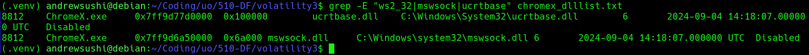
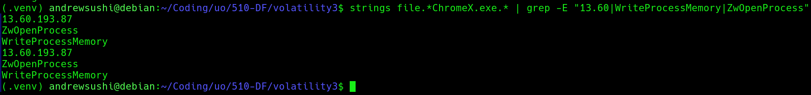

# Assignment 4 - Memory Forensics

### Environment and Setup
Clone the Volatility3 repository from GitHub:
```
https://github.com/volatilityfoundation/volatility3
```

Download the Windows symbol files:
```
https://downloads.volatilityfoundation.org/volatility3/symbols/windows.zip
```

Uncompress the downloaded archive and move the extracted windows directory into the Volatility symbols directory:
```
volatility3/volatility3/symbols/windows
```

Open a terminal in the root directory of the Volatility repository which should just be volatility3  

Run the following command to verify that Volatility is installed correctly:
```
python3 vol.py --help
```

If plugin dependency errors appear, install the required modeuls using pip:
```
pip install pefile yara-python pycryptodome
```

A python virtual enevironment was used to isolate dependencies and prevent system level conflicts. 

### Download and prepare memory image

The memory image used in this investigation was downlaoded and extracted from the provided course dataset. 

The compressed file memory_dump.hz was decompressed using the following command:
```
gunzip memory_dump.gz
```

This produced the raw memory image, `memory_dump`

The extracted memory image has a size of around 6.8 GB

To verify that Volatility could correctly parse the memory image, the follow command was executed:
```
python3 vol.py -f ~/Downloads/extracted/memory_dump banners.Banners
```

Successful execution of this command will confirm that the memory image could be read by Volatility and that the Windows kernel banner could be detected.

Next, the process list was examined to make sure that the analysis environment was functioning properly:
```
python3 vol.py -f ~/Downloads/extracted/memory_dump windows.pslist.PsList
```
After confirming that the process list could be extractd successfully, the memory image was ready for forensic investigation. 

### Memory Forensics Analysis: memory_dump

Data Integrity

Filename: memory_dump
SHA-256 Hash:
4d649e4448c3b513b1aa688bbf421a2d95cf4b18fc3c935f12f56f8cac91f07a

The SHA-256 hash of the extracted memory image was calculated prior to analysis to ensure the integrity of the forensic evidence. Hash verification establishes a bseline fingerprint for the file and confirms that the memory image remained unchanged throughout the investigation. 

1. Suspicious Process Identification: PID 8812, ChromeX.exe
```
Command Used:
python3 vol.py -f ~/Downloads/extracted/memory_dump windows.pslist.PsList
```

The system's process list revealed a process named ChromeX.exe with PID 8812. This process is considered suspicious because its name closely resembles the legit Google Chrome browser but contains and additional "X". This naming pattern is commonly used by malware to hide as trusted software while avoiding immediate detection. 

Upon further inspection of the process create time showed the ChromeX.exe started at 14:18:07 UTC which is significantly later than core system processes that start during system boot. This behaviour suggested that the executable was launched manually or by a user level action rather than by the operating system. 

2. Full Executable Path: C:\Users\developer\Downloads\ChromeX.exe

Command Used:
```
python3 vol.py -f ~/Downloads/extracted/memory_dump windows.cmdline.CmdLine --pid 8812
```

The cmdline plugin was used to retrieve the command line arguments associated with the suspicious process. 

The output showed that ChromeX.exe was executed from the following path
```
C:\Users\developer\Downloads\ChromeX.exe
```

This location is important since the Downloads directory is a common location for user downloaded files and malware. Legit applications are usually installed in directories like:
C:\Program Files
C:\Program Files (x86)

Running executable directly from a user's Downloads folder is unusual for legit software and therefore strengthens the suspicion that the ChromeX.exe is a malicious process that's hiding as a legit browser process. 

3. Process Behavior and Loaded Libraries

Command Used:
```
python3 vol.py -f ~/Downloads/extracted/memory_dump windows.dlllist.DllList --pid 8812
```

The dlllist plugin was used to examine the dynamic link libraries loaded by the suspicious process ChromeX.exe. Loaded libraries provide insight into the capabilities and behavior of a process.

Analysis revealed that the process loaded several Windows system libraries including:

ucrtbase.dll
C:\Windows\System32\ucrtbase.dll

mswsock.dll
C:\Windows\System32\mswsock.dll


The presence of mswsock.dll is particularly significant because this library provides Windows networking functionality through the Winsock API. Malware can usually load netowkring libarries in order to estblish communication with external systems. 
The loading of netowking related libaries indicate that ChromeX.exe likely possessed the capability to initiate outbout network connections which is consistent with the behavior of remote access malware or command and control implants. 

4. Extraction of Suspicious Executable from Memory

Command Used:
```
python3 vol.py -f ~/Downloads/extracted/memory_dump windows.dumpfiles.DumpFiles --pid 8812
```

The dumpfiles plugin was used to extract file objects associated with the suspicious process ChromeX.exe directly from the memory image. This allows investigators to recover executable artifacts that were loaded into memory at the time the system snapshot was captured.

The following files were successfully recovered:
```
file.0x860fd50276c0.0x860fccddecb0.DataSectionObject.ChromeX.exe.dat
file.0x860fd50276c0.0x860fd50f8a20.ImageSectionObject.ChromeX.exe.img
```
These files represent the data and executable sections of the ChromeX.exe binary as it existed in system memory.

To preserve the integrity of the recovered artifacts, we calculated SHA-256 hashes:
```
SHA-256: 0758ae0fedf4b4345c3d879481a6338b4980c9ab64bb591f4a736a5547975515
SHA-256: 09e2a819247a75b0de5cad6fe0a2812f38582ffdcef705edbe737678bb55299b
```
5. Indicators Discovered in the Extracted Executable

Command Used:
```
strings file.*ChromeX.exe.* | grep -E "13.60|WriteProcessMemory|ZwOpenProcess"
```

To further analyze the recovered executable, the strings utility was used to extract human-readable text embedded within the binary. This technique revealed internal metadata, API usage, and network indicators that may not be immediately noticable through standard memory analysis tools.

The analysis showed several suspicious artifacts including:

13.60.193.87
WriteProcessMemory
ZwOpenProcess
htb.pdb



The IP address 13.60.193.87 appears directly within the executable, which suggests that the program may attempt to communicate with a remote host. Hard-coded IP addresses can be commonly used by malware to establish communication with command-and-control infrastructure.

The presence of the Windows API functions WriteProcessMemory and ZwOpenProcess is also notable. These functions are frequently used by malware for process injection and memory manipulation, allowing malicious code to execute inside other processes.

Also, the string htb.pdb references a debugging symbol file generated during compilation. Embedded debugging paths can reveal developer build environments and further suggest that the binary was custom-built rather than part of a legitimate software distribution.

### Conclusion

The forensic investigation of the provided memory image identified a suspicious executable named ChromeX.exe with PID 8812. The process name closely mimics the legitimate Chrome browser but contains an additional character, indicating a likely attempt at trying to blend in.

Analysis revealed that the executable was launched from C:\Users\developer\Downloads, which is an unusual location for legitimate system applications. Examination of the process environment confirmed the loading of networking-related libraries and the presence of system handles associated with console interaction.

The executable was successfully extracted from memory using Volatility's dumpfiles plugin, and cryptographic hashes were generated to preserve the recovered artifacts. Further analysis of the binary revealed embedded indicators including the IP address 13.60.193.87 and Windows API calls commonly used for process manipulation.

Based on what we've found, we conclude that ChromeX.exe is highly likely to be a malicious program designed to hide as a legitimate application while communicating with an external host and performing potentially harmful actions on the system.