# Digital Forensics Handbook - Andrew Chan
# Table of Contents

- [Project 1 – Forensic Disk Imaging](#project-1)
- [Project 2 – Hypervisor Disk Image Examination](#project-2-hypervisor-disk-image-examination-report)
- [Project 3 – Creating and Analyzing ZFS Pools](#project-3-creating-and-analyzing-zfs-pools)
- [Project 4 – Memory Forensics](#assignment-4---memory-forensics)


# Project 1 
## 1. Objective
The objective of this project is to perform a forensic workflow starting with a VirtualBox disk image, .VDI, o produce a verified forensic image, .E01, and to document the integrity verification at each step. The goal is to presere evidence integrity while creating working and forensic copoies for analysis

## 2. Environment and Tools
**OS:** Windows (PowerShell)
**Hypervisor Image Format:** VirtualBox (.vdi)
**Tools Used:**
- PowerShell `get-filehash`
- QEMU `qemu-img`
- EWT Tools `ewfacquire`, `ewfverify`

All of these commands were executed locally within the virtual machine through HackTheBox

## 3. Evidence Intake
The original evidence file provided was a WirtualBox disk image.
- **Filename:** `FreeBSD_Forensics_PartI.vdi`

A SHA-256 hash was calculated to create a baseline integrity value before any changes were made

**Command Used:**
`get-filehash ./FreeBSD_Forensics_PartI.vdi -algorithm sha256`

**Result:**
- SHA-256 hash created and stored within a new file named `FreeBSD_Forensics_PartI.sha256sum`

This hash will then serve as a reference value for the original evidence

## 4. Conversion to RAW
To create forensic tooling compatibility, the VDI image will be converted into a RAW disk image using QEMU.

**Command Used:**
`C:\"Program Files"\qemu\qemu-img.exe convert -p -f vdi -O raw ./FreeBSD_Forensics_PartI.vdi ./FreeBSD_Forensics_PartI.raw`

The RAW image represents a sector by sector disk layot which is suitable for forensic usage. 

## 5. RAW Disk Validation
The RAW image was inspected and hashed to confirm successful conversion

**Disk Information:**
`C:\"Program Files"\qemu\qemu-img.exe info ./FreeBSD_Forensics_PartI.raw`

**Checksum Calculation:**
`get-filehash .\FreeBSD_Forensics_PartI.raw -algorithm sha256 > .\FreeBSD_Forensics_PartI-RAW.sha256sum`
**Result:**
- SHA-256 hash recorded and stored in a new file named `FreeBSD_Forensics_PartI-RAW.sha256sum`

The SHA-256 hash of the RAW image is different from the VDI hash. This makes sense because there is differences in file format and metadata layout.

## 6. Forensic Image Creation (E01)
The RAW image was acquired into the EWF (E01) using `ewfacquire`, which produced a forensic image with embedded metadata and integrity checks.

**Command Used:**
`ewfacquire ./FreeBSD_Forensics_PartI.raw`

**Acquisition Metadata:**
Examiner: Andrew
Case Number: 1
Evidence Number: 1
Media Type: Fixed Disk
Image Format: EnCase 6 (.E01)
Compression: Deflate
Sector Size: 512 bytes

The acquisition completed successfully without any errors. 

## 7. Forensic Image Verification
The integrity of the E01 image was verified using `ewfverify`

**Command Used:**
`ewfverify FreeBSD_Forensics_PartI.E01`

**Result:**
MD5 hash stored in E01: `a37fd5124513584ef27e421f37e522f1`
MD5 hash calculated during verification: `a37fd5124513584ef27e421f37e522f1`
Verfication Stats: SUCCESS

This confirms that the forensic image has not been altered since acquisition. 

## 8. Explanation of Hash Differences

The SHA-256 hashes of the `.vdi` and `.raw` files are difference because the conversion process changes the file structure, metadata, and block layout. However, the forensic integrity is preserved because the E01 image embeds its own hash values, which we saw were successfully verified using `ewfverify`.

## 9. What I learned
This project helped me understand the concepts of general forensics and how we can use hasing algorithms like SHA-256 as a checksum. I also learned things like Evidence intake, working copies, and forensic images. One big takeway is that forensic validity is created through repeatable verification rather than just matching hashes across different formats. Tools like `ewfverify` are able to provide stronger guarantees rather than simple file hashing by validating embedded integrity data. 

Some things that I learned that aren't related directly to the project is how the Windows filesystem paths differe from Linux. Windows uses volume specific root paths like `C:\` rather than a single unified root. Also, I learned that PowerShell doesn't rely on the `~` home directory convention in the same way that Linux does. 

## 10. Conclusion
All required steps for forensic imaging and preparation were completed successfully. The evidence pipeline preserved integrity at every stage which resulted in a verified forensic image that is suitable for further analysis in tools like Autopsy. 

# Project 2: Hypervisor Disk Image Examination Report
## Examination of Group 5 Disk Image

## 1. Case Overview
Our team (Team 7) received a compressed archive (`ToShare.zip`) containing a Linux virtual disk image (`ToShare.raw`) for forensic examination. The objective was to reconstruct user activity, identify structured artifacts, and evaluate potential cross-account behavior within the system. The image was analyzed using Autopsy, focusing on filesystem artifacts, user activity reconstruction, credential exposure, and session transitions between accounts.
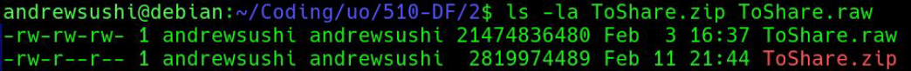
## 2. Evidence Handling & Integrity Preservation
Before we began the analysis, we extracted ToShare.raw from the provided archive and generated SHA-256 hashes for both the .zip file and the extracted .raw image. These hashes were recorded before any forensic examination began to preserve evidentiary integrity and maintain reproducibility. The raw disk image was ingested into Autopsy in a read-only forensic workflow. No modifications were made to the source image during analysis.

This process aligns with forensic best practices for:
- Integrity validation
- Chain-of-custody preservation
- Reproducibility of results
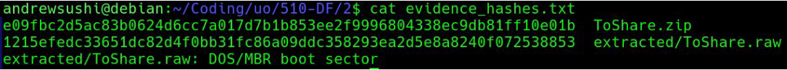

## 3. System Identification
Analysis of /etc/debian_version and filesystem metadata confirmed:
- Operating System: Debian Linux
- Filesystem: EXT4 
The EXT4 journaled filesystem is relevant because it preserves metadata timestamps (MAC times), which were used in timeline reconstruction.

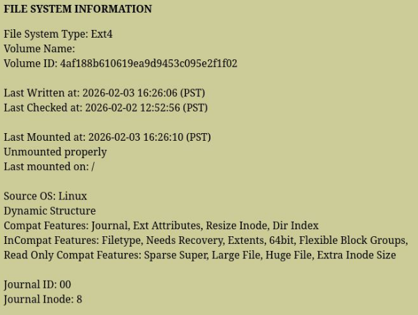

## 4. User Accounts & System Structure
Inspection of /etc/passwd revealed two interactive user accounts 
- user (UID 1000)
- squirrel (UID 1001)
Both accounts were configured with /bin/bash, confirming interactive shell access. This established the foundation for evaluating cross-account behavior.

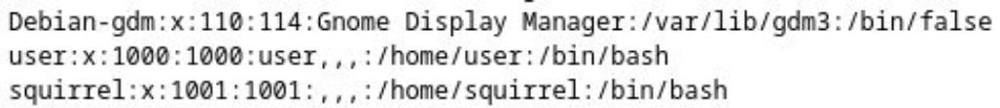

## 5. Structured Content Creation – User Account
**5.1 Image Artifacts**

Within /home/user/Pictures/, multiple thematically named images were identified:
- salmon.jpeg
- salmon2.jpeg
- salmon3.jpeg
- salmon4.jpeg
- squirrel.jpeg 

Timestamps clustered around February 2, 2026 (~13:40–13:43 PST), which suggests deliberate batch creation or collection.

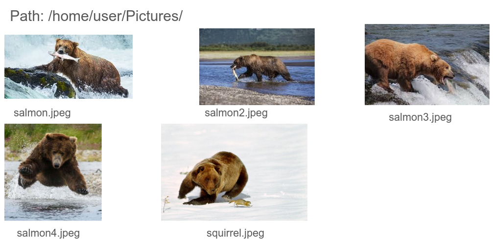

**5.2 Document Artifacts**

Under /home/user/Documents/, directories named salmon, salmon2, salmon3, salmon4, and squirrel contained text files describing types of salmon and squirrel. The timestamp clustering and consistent naming pattern indicate structured, intentional content creation rather than incidental storage.

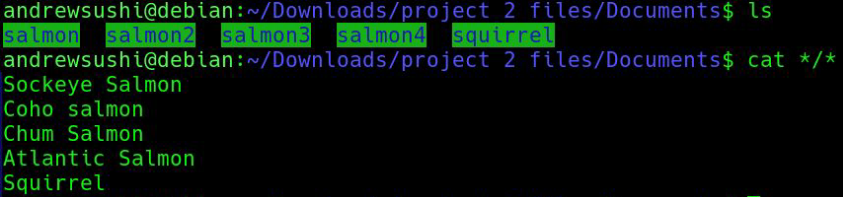

## 6. Application-Level Activity

Two key artifacts confirmed active user interaction:

- /home/user/.local/share/recently-used.xbel
- /home/user/.mozilla/firefox/.../places.sqlite 

The recently-used.xbel file recorded that the image files were opened in Firefox ESR. This demonstrates:

- Files were not merely stored
- They were intentionally accessed and viewed

This corroborates filesystem timestamps and strengthens the behavioral timeline.
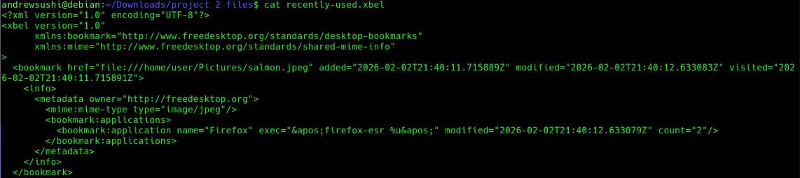
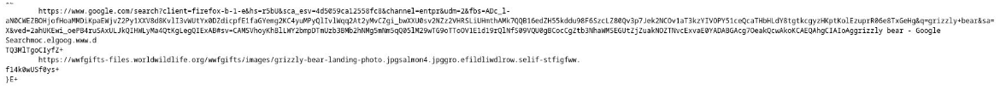

## 7. Shell & Editor Usage Corroboration
**7.1 Bash History**
/home/user/.bash_history showed:

- Directory creation
- File renaming
- sudo usage
- su - invocation 

The presence of su - is important, since it initiates a full login shell as another user, loading that user’s environment.
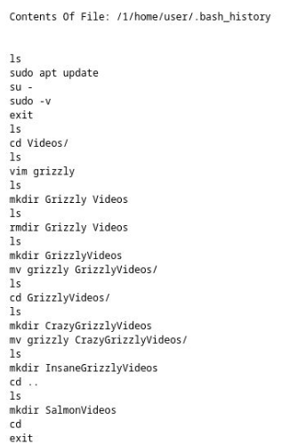

**7.2 Vim Metadata**
Both /home/user/.viminfo and /home/squirrel/.viminfo contained file marks and jump lists confirming document editing activity 

This independently verifies file modification beyond simple presence on disk.
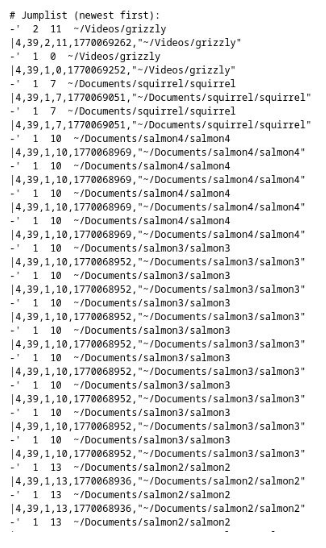

## 8. Cleartext Credential Discovery

A significant artifact was discovered at:

/home/user/Videos/GrizzlyVideos/CrazyGrizzlyVideos/grizzly

This file contained plaintext credentials:
```
Username: squirrel
pw: squirrel
```

This indicates insecure credential storage and provides a plausible mechanism explaining how cross-account access may have occurred.

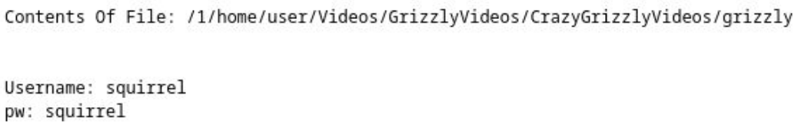

## 9. Confirmed Cross-Account Activity
**9.1 Login Database Evidence**
/var/log/wtmp.db (SQLite login database) confirmed authenticated session transitions 
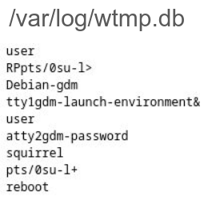
**9.2 Target File Creation**
Within /home/squirrel/target, an ASCII file containing:

“Good job, this is the end.”

was identified 

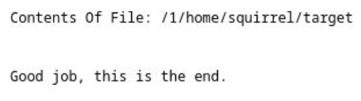

squirrel’s .bash_history confirmed:
- Creation of temporary directories
- Editing of target using vim
- Subsequent removal of temporary directories

This sequence demonstrates deliberate, interactive use of the squirrel account.

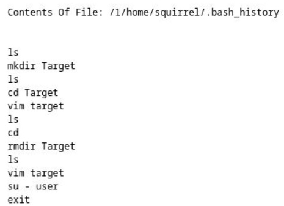
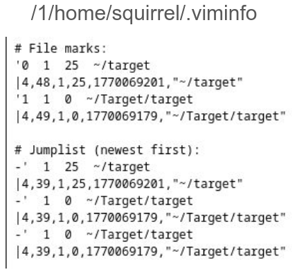

## 10. Deleted Files & Unallocated Space

Deleted files and unallocated space were examined through Autopsy analysis. No additional suspicious or hidden artifacts were identified beyond the structured content described above.

## 11. Conclusion

This Debian EXT4 system contained two interactive user accounts. Analysis confirmed:

- Structured content creation under the user account
- Insecure storage of plaintext credentials
- Execution of su - privilege transition
- Authenticated cross-account session activity
- Deliberate content creation under squirrel
- Correlated evidence across multiple independent artifact sources
- The artifacts are consistent and reinforcing. No contradictory or anomalous evidence was identified.

Confidence Level: High

# Project 3: Creating and Analyzing ZFS Pools
### 1 - Creating the ZFS Evidence Image
Step 1: Configure VM and Add Virtual Disks

First, download the Ubuntu Desktop ISO for VirtualBox at: 
`https://ubuntu.com/download/desktop`

In the VirtualBox manager, select the VM and click on settings. There go to storage -> Controller: SATA, and add a hard disk. Then, create a new disk with the following settings:

```
Type: VDI
Allocation: Dynamically Allocated
Size: 10 GB
Name: ZFS_Disk_1
```
Repeat this process to create a second disk:
```
Name: ZFS_Disk_2
Size: 10 GB
```

### Step 2 - Install ZFS
Launch the VM using the Ubuntu ISO and install Ubuntu normally.

Install ZFS utilities:
```
sudo apt update
sudo apt install zfsutils-linux
```
Verify the installation:
```
zfs --version
```

### Step 3 - Create the ZFS Pool

Create a mirrored ZFS pool:
```
sudo zpool create project_pool mirror sdb sdc
```
Verify the pool status:
```
zpool status
```
The pool should now be mounted at:
```
/project_pool
```

### Step 4 - Add Data and Create Snapshots

Create an initial file:
```
echo "Version 1: Basic Config" | sudo tee /project_pool/file1.txt
```
Create the first snapshot:
```
sudo zfs snapshot project_pool@snap1
```
Continue modifying or adding files and creating additional snapshots to capture system changes.

### Step 5 - Plant Evidence Artifacts

**Artifact 1 – Hidden Information Inside an Image**

Download an image file:
```
monkey.jpeg
```
Create a secret message:
```
echo "user: help pw: banana" | sudo tee /project_pool/do_not_share.txt
```
Hide the message inside the image:
```
cat ~/Downloads/monkey.jpeg /project_pool/do_not_share.txt | sudo tee /project_pool/image.jpeg
```
Create a snapshot:
```
sudo zfs snapshot project_pool@snap3
```
**Artifact 2 – Deleting Evidence**

Delete the original text file:
```
sudo rm /project_pool/do_not_share.txt
```
Modify image timestamps to obscure activity:
```
sudo touch -t 202510300132 /project_pool/image.jpeg
```
Clear shell history:
```
history -w
rm ~/.bash_history
```
Create another snapshot:
```
sudo zfs snapshot project_pool@snap4
Artifact 3 – Disguised Bash Script
```
Create a simple script:
```
echo '#!/bin/bash' | sudo tee /project_pool/malware.sh
echo 'ping -c 4 8.8.8.8' | sudo tee -a /project_pool/malware.sh
```
Rename it to appear harmless:
```
sudo mv /project_pool/malware.sh /project_pool/holiday_photo.jpg
```
Create a snapshot:
```
sudo zfs snapshot project_pool@snap5
```

### Step 6 - Finalize Evidence and Export ZFS Pool

Set the checksum algorithm:
```
sudo zfs set checksum=sha256 project_pool
```
Export the entire pool with snapshots:
```
sudo zfs send -Rw project_pool@snap6 > ~/project3_finalevidence.zfs
```
Transfer the file using:
- scp
- Google Drive
- OneDrive

To import later:
```
zfs receive
```
### Step 7 - Verify Evidence Integrity

Compute the SHA256 hash:
```
sha256sum project3_finalevidence.zfs
```
Example output:
```
d39ccb4b6b3e253be46df10de73f9236fd86c2e628cccbd03af4b2cc7f3904b8  /home/me/project3_finalevidence.zfs
```
**Part 2 – Forensic Analysis Using Autopsy (Group 8)**

This phase performs forensic analysis on a provided disk image.

Digital forensics emphasizes reconstructing system activity from artifacts to determine what actions occurred on a system. 

**Step 1: Verify Integrity of the RAW Image**

Run a SHA256 hash check:
```
Get-FileHash .\evidence_disk.raw -Algorithm SHA256
```
Example output:
```
SHA256
62DB3E442F82805437D3DE60C575FAF04496DB4EE8E25BE90CD60879B837D1DF
```
Confirm the hash matches the provided value before proceeding.

**Step 2: Load Image into Autopsy**

Open Autopsy

Create a New Case

Select:
```
Add Data Source → Disk Image
```
Load the file:
```
evidence_disk.raw
```
Allow Autopsy to perform automated analysis.

Artifact 1 – Orphan File Discovery
File Metadata
Name:
img_evidence_disk.raw/$OrphanFiles/OrphanFile-13

Type:
File System

MIME Type:
application/octet-stream

Size:
0

File Name Allocation:
Unallocated

Metadata Allocation:
Unallocated

Modified:
2026-02-28 15:45:44 PST

Accessed:
2026-02-28 15:45:44 PST

Created:
2026-02-28 15:45:44 PST

Changed:
2026-02-28 15:45:51 PST
Sleuth Kit istat Output
inode: 13
Not Allocated

Group: 0
Generation ID: 1553334934

uid / gid: 0 / 0
mode: rrw-r--r--

Flags: Extents
size: 0
num of links: 0
Inode Timestamps
Accessed:      2026-02-28 15:45:44 PST
File Modified: 2026-02-28 15:45:44 PST
Inode Modified:2026-02-28 15:45:51 PST
File Created:  2026-02-28 15:45:44 PST
Deleted:       2026-02-28 15:45:51 PST
Direct Blocks

# Assignment 4 - Memory Forensics

### Environment and Setup
Clone the Volatility3 repository from GitHub:
```
https://github.com/volatilityfoundation/volatility3
```

Download the Windows symbol files:
```
https://downloads.volatilityfoundation.org/volatility3/symbols/windows.zip
```

Uncompress the downloaded archive and move the extracted windows directory into the Volatility symbols directory:
```
volatility3/volatility3/symbols/windows
```

Open a terminal in the root directory of the Volatility repository which should just be volatility3  

Run the following command to verify that Volatility is installed correctly:
```
python3 vol.py --help
```

If plugin dependency errors appear, install the required modeuls using pip:
```
pip install pefile yara-python pycryptodome
```

A python virtual enevironment was used to isolate dependencies and prevent system level conflicts. 

### Download and prepare memory image

The memory image used in this investigation was downlaoded and extracted from the provided course dataset. 

The compressed file memory_dump.hz was decompressed using the following command:
```
gunzip memory_dump.gz
```

This produced the raw memory image, `memory_dump`

The extracted memory image has a size of around 6.8 GB

To verify that Volatility could correctly parse the memory image, the follow command was executed:
```
python3 vol.py -f ~/Downloads/extracted/memory_dump banners.Banners
```

Successful execution of this command will confirm that the memory image could be read by Volatility and that the Windows kernel banner could be detected.

Next, the process list was examined to make sure that the analysis environment was functioning properly:
```
python3 vol.py -f ~/Downloads/extracted/memory_dump windows.pslist.PsList
```
After confirming that the process list could be extractd successfully, the memory image was ready for forensic investigation. 

### Memory Forensics Analysis: memory_dump

Data Integrity

Filename: memory_dump
SHA-256 Hash:
4d649e4448c3b513b1aa688bbf421a2d95cf4b18fc3c935f12f56f8cac91f07a

The SHA-256 hash of the extracted memory image was calculated prior to analysis to ensure the integrity of the forensic evidence. Hash verification establishes a bseline fingerprint for the file and confirms that the memory image remained unchanged throughout the investigation. 

1. Suspicious Process Identification: PID 8812, ChromeX.exe
```
Command Used:
python3 vol.py -f ~/Downloads/extracted/memory_dump windows.pslist.PsList
```

The system's process list revealed a process named ChromeX.exe with PID 8812. This process is considered suspicious because its name closely resembles the legit Google Chrome browser but contains and additional "X". This naming pattern is commonly used by malware to hide as trusted software while avoiding immediate detection. 

Upon further inspection of the process create time showed the ChromeX.exe started at 14:18:07 UTC which is significantly later than core system processes that start during system boot. This behaviour suggested that the executable was launched manually or by a user level action rather than by the operating system. 

2. Full Executable Path: C:\Users\developer\Downloads\ChromeX.exe

Command Used:
```
python3 vol.py -f ~/Downloads/extracted/memory_dump windows.cmdline.CmdLine --pid 8812
```

The cmdline plugin was used to retrieve the command line arguments associated with the suspicious process. 

The output showed that ChromeX.exe was executed from the following path
```
C:\Users\developer\Downloads\ChromeX.exe
```
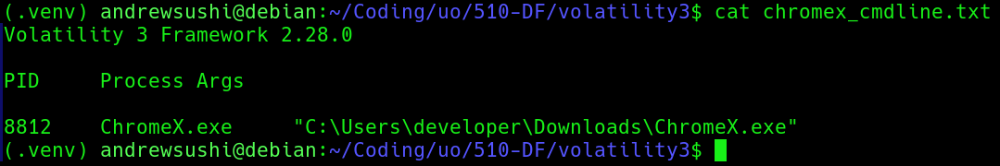
This location is important since the Downloads directory is a common location for user downloaded files and malware. Legit applications are usually installed in directories like:
C:\Program Files
C:\Program Files (x86)

Running executable directly from a user's Downloads folder is unusual for legit software and therefore strengthens the suspicion that the ChromeX.exe is a malicious process that's hiding as a legit browser process. 

3. Process Behavior and Loaded Libraries

Command Used:
```
python3 vol.py -f ~/Downloads/extracted/memory_dump windows.dlllist.DllList --pid 8812
```

The dlllist plugin was used to examine the dynamic link libraries loaded by the suspicious process ChromeX.exe. Loaded libraries provide insight into the capabilities and behavior of a process.

Analysis revealed that the process loaded several Windows system libraries including:

ucrtbase.dll
C:\Windows\System32\ucrtbase.dll

mswsock.dll
C:\Windows\System32\mswsock.dll


The presence of mswsock.dll is particularly significant because this library provides Windows networking functionality through the Winsock API. Malware can usually load netowkring libarries in order to estblish communication with external systems. 
The loading of netowking related libaries indicate that ChromeX.exe likely possessed the capability to initiate outbout network connections which is consistent with the behavior of remote access malware or command and control implants. 

4. Extraction of Suspicious Executable from Memory

Command Used:
```
python3 vol.py -f ~/Downloads/extracted/memory_dump windows.dumpfiles.DumpFiles --pid 8812
```

The dumpfiles plugin was used to extract file objects associated with the suspicious process ChromeX.exe directly from the memory image. This allows investigators to recover executable artifacts that were loaded into memory at the time the system snapshot was captured.

The following files were successfully recovered:
```
file.0x860fd50276c0.0x860fccddecb0.DataSectionObject.ChromeX.exe.dat
file.0x860fd50276c0.0x860fd50f8a20.ImageSectionObject.ChromeX.exe.img
```
These files represent the data and executable sections of the ChromeX.exe binary as it existed in system memory.

To preserve the integrity of the recovered artifacts, we calculated SHA-256 hashes:
```
SHA-256: 0758ae0fedf4b4345c3d879481a6338b4980c9ab64bb591f4a736a5547975515
SHA-256: 09e2a819247a75b0de5cad6fe0a2812f38582ffdcef705edbe737678bb55299b
```
5. Indicators Discovered in the Extracted Executable

Command Used:
```
strings file.*ChromeX.exe.* | grep -E "13.60|WriteProcessMemory|ZwOpenProcess"
```

To further analyze the recovered executable, the strings utility was used to extract human-readable text embedded within the binary. This technique revealed internal metadata, API usage, and network indicators that may not be immediately noticable through standard memory analysis tools.

The analysis showed several suspicious artifacts including:

13.60.193.87
WriteProcessMemory
ZwOpenProcess
htb.pdb


The IP address 13.60.193.87 appears directly within the executable, which suggests that the program may attempt to communicate with a remote host. Hard-coded IP addresses can be commonly used by malware to establish communication with command-and-control infrastructure.

The presence of the Windows API functions WriteProcessMemory and ZwOpenProcess is also notable. These functions are frequently used by malware for process injection and memory manipulation, allowing malicious code to execute inside other processes.

Also, the string htb.pdb references a debugging symbol file generated during compilation. Embedded debugging paths can reveal developer build environments and further suggest that the binary was custom-built rather than part of a legitimate software distribution.

### Conclusion

The forensic investigation of the provided memory image identified a suspicious executable named ChromeX.exe with PID 8812. The process name closely mimics the legitimate Chrome browser but contains an additional character, indicating a likely attempt at trying to blend in.

Analysis revealed that the executable was launched from C:\Users\developer\Downloads, which is an unusual location for legitimate system applications. Examination of the process environment confirmed the loading of networking-related libraries and the presence of system handles associated with console interaction.

The executable was successfully extracted from memory using Volatility's dumpfiles plugin, and cryptographic hashes were generated to preserve the recovered artifacts. Further analysis of the binary revealed embedded indicators including the IP address 13.60.193.87 and Windows API calls commonly used for process manipulation.

Based on what we've found, we conclude that ChromeX.exe is highly likely to be a malicious program designed to hide as a legitimate application while communicating with an external host and performing potentially harmful actions on the system.